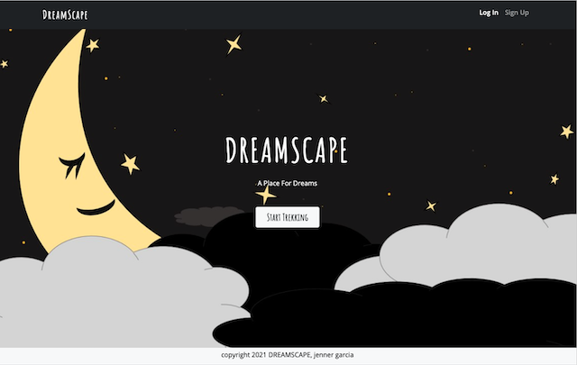

# Project2-DreamScape
A place for dreams 

- [Description](#Description)
- [Technologies](#Technologies)
- [Screenshots](#Screenshots)
- [Repository](#Repository)
- [Deployment](#Deployment)
- [Notes](#Notes)

## Description

Jot down dreams, read, update and check out your dream stats.

## Technologies

- Node.js
- Express
- MySQL database
- Dependencies
  - [sequelize](https://www.npmjs.com/package/sequelize)
  - [mysql2](https://www.npmjs.com/package/mysql2)
  - [express handlebars](https://www.npmjs.com/package/express-handlebars)
  - [passport](https://www.npmjs.com/package/passport)
  - [crypt](https://www.npmjs.com/package/bcrypt)
  - [express-session](https://www.npmjs.com/package/express-session)
- [Chart.js](https://www.chartjs.org/)
- Bootstrap
- Google Fonts

## Repository

- GitHub Repo/Code: https://github.com/jenneration/Project2-DreamScape (*Rookie here - do don't judge!!!!*)

## Deployment

- Checkout DreamScape on [Heroku](https://fathomless-woodland-79338.herokuapp.com/)

- **IMPORTANT** Please LOGIN with the user and pw below for a populated site to test - sign up to start new.

    - EMAIL:  **Ozzy@gmail.com**

    - PASSWORD:  **password**

## Notes
*Hello! Please know this is a still-evloving site. Future enhancements are planned and will happen soon!*

## Screenshots

